# PHYSICS 2 - Electromagnetism 

## Introduction to Electromagnetism

### Preliminary Notes

#### Electric Charge is a Property of matter

- Two types of charge: Positive $(-)$ & $(+)$

<figure align="center">
  
  <figcaption><b>Fig.1</b> - Types of charges.</figcaption>
</figure>

- Charge of a single electron: $q=-e=-1.602 \times 10^{-19}~\text{C}$
- Charge of a single proton: $q=+e=+1.602 \times 10^{-19}~\text{C}$
- Charge is conserved (Can't be created or destroyed)
- Charge is quantized (exist in multiples of $e$)

#### Two kinds of matter

- **Insulators:** Charges cannot move, they are "fixed"
- **Conductors:** Charges are free to move around

<figure align="center">
  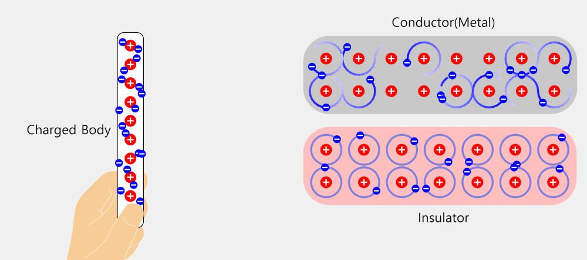
  <figcaption><b>Fig.2</b> - Conductors vs. Insulators.</figcaption>
</figure>

## PHGN 100 - Equations

Useful Constants

### Useful Constants

- $g=9.81 \frac{\mathrm{m}}{\mathrm{s}^{2}}$
- $G=6.67 \times 10^{-11} \frac{\mathrm{N} \cdot \mathrm{m}^{2}}{\mathrm{~kg}^{2}}$

Vector Principles

### Vector Principles

- $\vec{A}=A_{x} \hat{\imath}+A_{y} \hat{\jmath}+A_{z} \hat{k}$

- $A \equiv|\vec{A}|=\sqrt{A_{x}^{2}+A_{y}^{2}+A_{z}^{2}}$

- $\hat{A}=\frac{\vec{A}}{A}$

- $\Delta \vec{A} \equiv \vec{A_{\mathrm{f}}}-\vec{A}_{\mathrm{i}}$

- $\left|\vec{A} \times \vec{B}\right|=A B \sin \theta$

- $\vec{A} \times \vec{B}=\left(A_{y} B_{z}-A_{z} B_{y}\right) \hat{\imath}-\left(A_{x} B_{z}- A_{z} B_{x}\right) \hat{\jmath}+\left(A_{x} B_{y}-A_{y} B_{x}\right) \hat{k}$

- $\vec{A} \cdot \vec{B}=A B \cos \theta=A_{x} B_{x}+A_{y} B_{y}+A_{z} B_{z}$

#### Center of Mass
$$\vec{r}_{\mathrm{cm}}=\frac{1}{m_{\mathrm{tot}}} \sum_{j} m_{j} \vec{r}_{j}; \quad \vec{r}_{\mathrm{cm}}=\frac{\int \vec{r} \mathrm{~d} m}{m_{\mathrm{tot}}}$$

Kinematics

### Kinematics

- $\vec{r}(t)=$ Position Vector

- $\vec{v} \equiv \frac{\mathrm{d} \vec{r}}{\mathrm{~d} t} \Rightarrow \vec{r}(t)=\vec{r}\left(t_{\mathrm{i}}\right)+\int_{t_{\mathrm{i}}}^{t} \vec{v}\left(t^{\prime}\right) \mathrm{d} t^{\prime}$

- $\vec{a} \equiv \frac{\mathrm{d} \vec{v}}{\mathrm{~d} t}=\frac{\mathrm{d}^{2} \vec{r}}{\mathrm{~d} t^{2}} \Rightarrow \vec{v}(t)=\vec{v}\left(t_{\mathrm{i}}\right)+\int_{t_{\mathrm{i}}}^{t} \vec{a}\left(t^{\prime}\right) \mathrm{d} t^{\prime}$

#### Average Velocity

$$\vec{v}_{\mathrm{av}} \mid t_{\mathrm{i}_{\mathrm{i}}}^{t_{\mathrm{f}}} \equiv \frac{1}{\Delta t} \int_{t_{i}}^{t_{f}} \vec{v}\left(t^{\prime}\right) \mathrm{d} t^{\prime}=\frac{\Delta \vec{r}}{\Delta t}$$

#### Average Acceleration
$$\vec{a}_{\text {av }}|_{t_{\mathrm{i}}}^{t_{\mathrm{f}}} \equiv \frac{1}{\Delta t} \int_{t_{i}}^{t_{f}} \vec{a}\left(t^{\prime}\right) \mathrm{d} t^{\prime}=\frac{\Delta \vec{v}}{\Delta t}$$

Translational Dynamics and Different Forces

### Translational Dynamics and Different Forces

#### Newton's Second Law for Translation: 

$$\sum_{j} \vec{F}_{j \mathrm{~b}}=m_{\mathrm{b}} \vec{a}_{\mathrm{b}, \mathrm{cm}}$$

#### Newton's Third Law

$$\vec{F}_{\text {ab }}=-\vec{F}_{\text {ba }}$$

#### Friction

$$f_{\mathrm{s}, \mathrm{ab}} \leq \mu_{\mathrm{s}} N_{\mathrm{ab}} ; \quad f_{\mathrm{k}, \mathrm{ab}}=\mu_{\mathrm{k}} N_{\mathrm{ab}}$$

#### Ideal Spring 

$$F_{\mathrm{sp} \mathrm{ab}, x}(t)=-k\left[x(t)-x_{0}\right]$$

#### Universal Gravitation

$$\vec{F}_{\mathrm{G}, \mathrm{ab}}=-\frac{G m_{\mathrm{a}} m_{\mathrm{b}}}{r_{\mathrm{ab}}^{2}} \hat{\boldsymbol{r}}_{\mathrm{ab}}=-\frac{G m_{\mathrm{a}} m_{\mathrm{b}}}{r_{\mathrm{ab}}^{3}} \vec{\boldsymbol{r}}_{\mathrm{ab}}$$

#### Weight

$$\vec{W}_{\mathrm{Eb}}=m_{\mathrm{b}} \vec{g}$$

#### Gravitational Field

$$\vec{g}\left(\vec{r}_{\mathrm{b}}\right)=-\sum_{j} \frac{G m_{j}}{r_{j \mathrm{~b}}^{2}} \hat{r}_{j \mathrm{~b}}=-\sum_{j} \frac{G m_{j}}{r_{j \mathrm{~b}}^{3}} \vec{r}_{j \mathrm{~b}}$$

Circular Motion

### Circular Motion

- $s(t)=$ Arc Length

#### Angular Position

$$\theta(t) \equiv \frac{s(t)}{R}$$

#### Angular Velocity

$$\omega(t) \equiv \frac{\mathrm{d} \theta(t)}{\mathrm{d} t} \Rightarrow \theta(t)=\theta\left(t_{\mathrm{i}}\right)+\int_{t_{\mathrm{i}}}^{t} \omega\left(t^{\prime}\right) \mathrm{d} t^{\prime}$$

#### Angular Acceleration 

$$\alpha(t) \equiv \frac{\mathrm{d} \omega(t)}{\mathrm{d} t}=\frac{\mathrm{d}^{2} \theta(t)}{\mathrm{d} t^{2}} \Longrightarrow \omega(t)=\omega\left(t_{\mathrm{i}}\right)+\int_{t_{\mathrm{i}}}^{t} \alpha\left(t^{\prime}\right) \mathrm{d} t^{\prime}$$

#### Centripetal Acceleration

$$a_{\mathrm{c}}(t)=\frac{v_{\mathrm{t}}(t)^{2}}{R}=\omega(t)^{2} R$$

#### Tangential Velocity

$$v_{\mathrm{t}}(t) \equiv \frac{\mathrm{d} s(t)}{\mathrm{d} t}=\omega(t) R$$

#### Tangential Acceleration

$$a_{\mathrm{t}}(t) \equiv \frac{\mathrm{d} v_{\mathrm{t}}(t)}{\mathrm{d} t}=\alpha(t) R$$

Simple Harmonic Motion

### Simple Harmonic Motion

Relationship between $a_{x}(t)$ and $x(t): a_{x}(t)=-\omega^{2}\left[x(t)-x_{\mathrm{eq}}\right]$

#### Position 
$$x(t)=A \sin (\omega t+\delta)+x_{\mathrm{eq}}$$

#### Mass-Spring System

$$\omega=\sqrt{\frac{k}{m}}$$

#### Frequency, Angular Frequency, Period

$$f=\frac{1}{T} ; \quad \omega=2 \pi f$$

Rotational Motion

### Rotational Motion

#### Newton's Second Law for Rotation

$$\sum_{j} \vec{\tau}_{j \mathrm{~b}}=I_{\mathrm{b}} \vec{\alpha}_{\mathrm{b}}$$

#### Torque

$$\vec{\tau}_{\mathrm{ab}}=\vec{r} \times \vec{F}_{\mathrm{ab}} ; \quad \tau_{\mathrm{ab}}=r_{\perp} F_{\mathrm{ab}}=r F_{\mathrm{ab} \perp}=r F_{\mathrm{ab}} \sin \theta$$

#### Rolling 

$$x_{\mathrm{cm}}=R \theta(t) ; \quad v_{\mathrm{cm}}=R \omega(t) ; \quad a_{\mathrm{cm}}=R \alpha(t)$$

Moments of Inertia and Inertial Calculus

### Moments of Inertia and Inertial Calculus

#### Point Mass

$$I=m r^{2};~\text{Cylindrical Shell (Hoop)}: I_{\mathrm{cm}}=m R^{2}$$

#### Thin Rod/Stick

$$I_{\mathrm{cm}}=(1 / 12) m L^{2} ; \quad I_{\mathrm{end}}=(1 / 3) m L^{2}$$

#### Solid Disk (Cylinder)

$$I_{\mathrm{cm}}=(1 / 2) m R^{2}$$

#### Solid Sphere

$$I_{\mathrm{cm}}=(2 / 5) m R^{2}$$

#### Hollow Sphere

$$I_{\mathrm{cm}}=(2 / 3) m R^{2}$$

#### Continuous Objects

$$m_{\mathrm{tot}}=\int \mathrm{d} m ; \quad I_{\mathrm{tot}}=\int \mathrm{d} I$$

$$\mathrm{d} m=\rho \mathrm{d} V(3 \mathrm{D}) ; \quad \mathrm{d} m=\sigma \mathrm{d} A(2 \mathrm{D}) ; \quad \mathrm{d} m=\lambda \mathrm{d} \ell(1 \mathrm{D})$$

Work, Energy, and Power

### Work, Energy, and Power

#### Work-Energy Theorem: 

$$W_{\text {tot }}=\Delta E_{\mathrm{sys}}$$

### Work

$$W_{\vec{F}_{\mathrm{ab}}}=\int_{\vec{s}_{b, \mathrm{i}}}^{\vec{s}_{b, \mathrm{f}}} \vec{F}_{\mathrm{ab}} \cdot \mathrm{d} \vec{s} ; d \vec{s}=d x \hat{\imath}+d y \hat{\jmath}+d z \hat{k}$$

$$W_{\vec{\tau}_{\mathrm{ab}}}=\int_{\theta_{b, \mathrm{i}}}^{\theta_{b, \mathrm{f}}} \tau_{\mathrm{ab}} \mathrm{d} \theta$$

#### Power

$$P_{\vec{F}_{\mathrm{ab}}} \equiv \frac{\mathrm{d} W_{\vec{F}_{\mathrm{ab}}}(t)}{\mathrm{d} t}=\vec{F}_{\mathrm{ab}} \cdot \vec{v}(t)$$

#### Change in PE

$$\Delta U_{\vec{F}_{\mathrm{ab}}} \equiv-\int_{\vec{s}_{b, \mathrm{i}}}^{\vec{s}_{\mathrm{ab}}} \vec{F}_{\mathrm{ab}} \cdot \mathrm{d} \vec{s}$$

#### Force from PE

$$\vec{F}_{\mathrm{ab}}=-\vec{\nabla} U_{\vec{F}_{\mathrm{ab}}} ; \quad$ in $1 \mathrm{D} F_{\mathrm{ab}, x}=-\frac{\mathrm{d} U_{\vec{F}_{\mathrm{ab}}}}{\mathrm{d} x}$$

#### Earth's Gravitational PE: $\Delta U_{G}=-\frac{G m_{\mathrm{E}} m_{\mathrm{b}}}{r_{\mathrm{b}, \mathrm{f}}}+\frac{G m_{\mathrm{E}} m_{\mathrm{b}}}{r_{\mathrm{b}, \mathrm{i}}}$

#### Near Earth

$$\Delta U_{g}=m_{\mathrm{b}} g\left(y_{\mathrm{b}, \mathrm{f}}-y_{\mathrm{b}, \mathrm{i}}\right)$$

#### Ideal Spring PE

$$\Delta U_{\mathrm{sp}}=\frac{1}{2} k\left(x_{\mathrm{b}, \mathrm{f}}-x_{0}\right)^{2}-\frac{1}{2} k\left(x_{\mathrm{b}, \mathrm{i}}-x_{0}\right)^{2}$$

#### Kinetic Energies

$$K_{\mathrm{T}}=\frac{1}{2} m v_{\mathrm{cm}}^{2} ; \quad K_{\mathrm{R}}=\frac{1}{2} I \omega_{\mathrm{cm}}^{2}$$

#### Thermal Energy

$$\Delta E_{\text {therm }, \mathrm{ab}}=f_{\mathrm{k}, \mathrm{ab}} s_{\mathrm{ab}}$$

Momenta and Impulse

### Momenta and Impulse

#### Linear-Impulse-Momentum Theorem

$$\sum_{j} \vec{I}_{\vec{F}_{j \mathrm{~b}}}=\Delta \vec{p}_{\mathrm{b}}$$

#### Angular-Impulse-Momentum Theorem

$$\sum_{j} \vec{I}_{\vec{\tau}_{j \mathrm{~b}}}=\Delta \vec{L}_{\mathrm{b}}$$

#### Linear Momentum
$$\vec{p} \equiv m \vec{v}_{\mathrm{cm}}$$

#### Angular Momentum

$$\vec{L}_{\mathrm{T}} \equiv \vec{r} \times \vec{p} ; \quad \vec{L}_{\mathrm{R}}=I \vec{\omega}$$

#### Impulse
$$\vec{I}_{\vec{F}_{\mathrm{ab}}} \equiv \int_{t_{\mathrm{i}}}^{t_{\mathrm{f}}} \vec{F}_{\mathrm{ab}} \mathrm{d} t ; \quad \vec{I}_{\vec{\tau}_{\mathrm{ab}}} \equiv \int_{t_{\mathrm{i}}}^{t_{\mathrm{f}}} \vec{\tau}_{\mathrm{ab}} \mathrm{d} t$$

#### Average Force and Linear Momentum

$$\sum_{j} \vec{F}_{j \mathrm{~b}, \mathrm{av}}=\frac{\Delta \vec{p}_{\mathrm{b}}}{\Delta t}$$

#### Average Torque and Angular Momentum

$$\sum_{j} \vec{\tau}_{j \mathrm{~b}, \mathrm{av}}=\frac{\Delta \vec{L}_{\mathrm{b}}}{\Delta t}$$

#### Kinetic Energies and Momenta

$$K_{\mathrm{T}}=\frac{p^{2}}{2 m} ; \quad K_{\mathrm{R}}=\frac{L^{2}}{2 I}$$

#### Elastic collisions, 2 objects, 1D

$$v_{2 \mathrm{f}, x}-v_{1 \mathrm{f}, x}=v_{1 \mathrm{i}, x}-v_{2 \mathrm{i}, x}$$

## PHGN 200 - Equations

Maxwell's Equations

### Maxwell's Equations

#### Gauss's Law for Electric Field

$$\oint \vec{\boldsymbol{E}} \cdot d \vec{\boldsymbol{A}}=\frac{Q_{\text {encl }}}{\varepsilon_{0}}=4 \pi k Q_{\text {encl}}$$

##### Electric Flux

$$\Phi_{E}=\int \vec{\boldsymbol{E}} \cdot d \vec{\boldsymbol{A}}$$

#### Gauss's Law for Magnetic Field

$$\oint \vec{\boldsymbol{B}} \cdot d \vec{\boldsymbol{A}}=0$$

##### Magnetic Flux

$$\Phi_{B}=\int \vec{\boldsymbol{B}} \cdot d \vec{\boldsymbol{A}}$$

#### Ampère/Maxwell

$$\oint \vec{\boldsymbol{B}} \cdot d \vec{\boldsymbol{\ell}}=\mu_{0} I_{\text {thru }}+\mu_{0} \epsilon_{0} \frac{d \Phi_{E}}{d t}$$

#### Faraday's Law

$$\mathcal{E}_{\text {induced }}=\oint(\vec{\boldsymbol{E}}+\vec{\boldsymbol{v}} \times \vec{\boldsymbol{B}}) \cdot d \vec{\boldsymbol{\ell}}=-\frac{d \Phi_{B}}{d t}$$

Fields, Forces, and Energy

### Fields, Forces, and Energy

#### Electric field

$$d \vec{\boldsymbol{E}}=\frac{k d Q}{r^{2}} \hat{\boldsymbol{r}}=\frac{k d Q}{r^{3}} \vec{\boldsymbol{r}} ; \quad \vec{\boldsymbol{F}}_{\text {electron on q }}=q \vec{\boldsymbol{E}}_{\text {at q }}$$

#### Electric potential

$$\Delta V=V_{B}-V_{A}=-\int_{A}^{B} \vec{\boldsymbol{E}} \cdot d \vec{\boldsymbol{\ell}} ; \quad E_{x}=-\frac{d V}{d x} ; \quad d V=\frac{k d Q}{r}$$

#### Electrostatic energy

$$\Delta U_{\text {of q }}=q \Delta V$$

#### Dielectrics

$$\epsilon_{\mathrm{in}}=\kappa_{E} \epsilon_{0} ; C=\kappa_{E} C_{0}$$

#### Magnetic field

$$d \vec{\boldsymbol{B}}=\frac{\mu_{0} I d \vec{\ell} \times \hat{\boldsymbol{r}}}{4 \pi r^{2}}=\frac{\mu_{0} I \vec{\boldsymbol{\ell}} \times \vec{\vec{r}}}{4 \pi r^{3}}$$

#### Magnetic force

$$d \vec{\boldsymbol{F}}=I d \vec{\boldsymbol{\ell}} \times \vec{\boldsymbol{B}} ; \quad \vec{\boldsymbol{F}}_{\text {on q }}^{\mathrm{mag}}=q \vec{\boldsymbol{v}} \times \vec{\boldsymbol{B}}$$

#### Magnetic dipole

$$\vec{\boldsymbol{\mu}}=N I \vec{\boldsymbol{A}} ; \quad \vec{\boldsymbol{\tau}}=\vec{\boldsymbol{\mu}} \times \vec{\boldsymbol{B}} ; \quad U=-\vec{\boldsymbol{\mu}} \cdot \vec{\boldsymbol{B}}$$

Circuits

### Circuits

#### Resistors

$$V=I R ; \quad d R=\frac{\rho d L}{A} ; \quad R_{\text {series }}=\sum_{i} R_{i} ; R_{\text {parallel }}=\left(\sum R_{i}^{-1}\right)^{-1}$$

#### Capacitors

$$C=\frac{Q}{|\Delta V|} ; U_{\mathrm{C}}=\frac{1}{2} C(\Delta V)^{2} ; C_{\text {series }}=\left(\sum_{i} C_{i}{ }^{-1}\right)^{-1} ; C_{\text {parallel }}=\sum_{i} C_{i} ; C=\kappa_{E} C_{0}$$

#### Current

$$I=\frac{d Q}{d t}=n|q| v_{\mathrm{d}} A ; \vec{\boldsymbol{J}}=n q \vec{\boldsymbol{v}}_{\mathrm{d}}$$

#### Power

$$P=I \Delta V$$

#### Kirchhoff's Laws

$$\sum_{\text {Closed loop }} \Delta V_{i}=0 ; \quad \sum I_{\text {in }}=\sum I_{\text {out }}$$

#### RC Circuits

$$Q(t)=Q_{\text {final }}\left(1-e^{-t / R C}\right) ; \quad Q(t)=Q_{\text {initial }} e^{-t / R C}$$

#### AC Circuits

$$X_{\mathrm{C}}=\frac{1}{\omega C}; \quad  V_{\mathrm{C}}=I X_{\mathrm{C}}; \quad Z=\sqrt{R^{2}+X_{\mathrm{C}}^{2}}; \quad V=I Z; \quad V_{r m s}=\frac{V_{\text {peak }}}{\sqrt{2}}$$

#### Inductors

$$\mathcal{E}_{\text {ind }}=-L \frac{d I}{d t} ; \quad L=\frac{N \Phi_{\mathrm{B}, 1 \text { turn }}}{I} ; \quad U_{\mathrm{B}}=\frac{1}{2} L I^{2}$$

#### Inductance

$$M_{12}=\frac{N_2\Phi_{B,~\text{one turn of 2}}}{I_{\text{in}~1}}; \quad \mathcal{E}_1 = M_{12} \frac{dI_{2}}{dt}$$

#### LR Circuits

$$I(t)=I_{\text {final }}\left(1-e^{-t /(L / R)}\right) ; I(t)=I_{\text {initial }} e^{-t /(L / R)}$$

Electromagnetic Waves Optics and Field Energy Density

### Electromagnetic Waves Optics and Field Energy Density

#### Field Energy/Momentum

$$u_{E}=\frac{1}{2} \varepsilon_{0} E^{2} ; \quad u_{B}=\frac{1}{2 \mu_{0}} B^{2} ; \quad p=\frac{U}{c}$$

#### Wave Properties 
$$\quad v=\lambda f ; \quad k=\frac{2 \pi}{\lambda} ; \quad \omega=2 \pi f ; \quad E=c B$$

#### Intensity

$$\vec{\boldsymbol{S}}=\frac{1}{\mu_{0}}(\vec{\boldsymbol{E}} \times \vec{\boldsymbol{B}}) ; \quad I=|\vec{\boldsymbol{S}}|_{\text {avg }}=c \frac{1}{2} \varepsilon_{0} E_{\mathrm{m}}^{2}=\frac{P_{\text {av }}}{A}$$

#### Reflection & Refraction

$$v_{\text {in material }}=c / n_{1} ; \quad \theta_{\text {inc }}=\theta_{\text {ref }} ; \quad n_{1} \sin \left(\theta_{\text {inc }}\right)=n_{2} \sin \left(\theta_{\text {trans }}\right)$$

#### Interference

##### Constructive

$$\Delta r=m \lambda$$

##### Destructive

$$\Delta r=\left(m+\frac{1}{2}\right) \lambda$$

#### Bragg

$$2 d \sin (\theta)=m \lambda$$ 

##### Double-slit

$$d \sin (\theta)=m \lambda \quad \text{or}\quad\underbrace{\frac{d y_{m}}{R}=m \lambda}_{\text{for small}~\theta}$$

Additional Information & Useful Constants

### Additional Information & Useful Constants

#### Electric fields

$$E_{\text {inf sheet }}=\frac{\sigma}{2 \varepsilon_{0}} ; \quad E_{\text {inf line }}=2 k \lambda / r ; \quad \vec{\boldsymbol{E}}_{\text {charged ring }}=\frac{k Q x}{\left(x^{2}+a^{2}\right)^{3 / 2}} \hat{i} ; \quad C_{\text {parallel plate }}=\frac{\varepsilon_{0} A}{d}$$

#### Magnetic fields

$$B_{\text {infinite wire }}=\frac{\mu_{0} I}{2 \pi r} ; \quad B_{\text {solenoid }}=\mu_{0} n I ; \quad L_{\text {solenoid }}=\mu_{0} n^{2} A \ell ; \quad B_{\text {current loop }}=\frac{\mu_{0} N I R^{2}}{2\left(x^{2}+R^{2}\right)^{3 / 2}}$$

#### Fundamental Charge

$$e=1.602 \times 10^{-19} \mathrm{C}$$

##### Electron Mass:

$$m_{\mathrm{e}}=9.11 \times 10^{-31} \mathrm{~kg}$$

##### Proton Mass

$$m_{\mathrm{p}}=1.673 \times 10^{-27} \mathrm{~kg}$$

#### Other Constants

- $k=\frac{1}{4 \pi \varepsilon_{0}}=9 \times 10^{9}\left(\frac{\mathrm{~N} \cdot \mathrm{m}^{2}}{\mathrm{C}^{2}}\right)$

- $\epsilon_{0}=8.85 \times 10^{-12} \frac{\mathrm{F}}{\mathrm{m}}$
- $\mu_{0}=4 \pi \times 10^{-7} \frac{\mathrm{Tm}}{\mathrm{A}}=1.2566 \times 10^{-6} \frac{\mathrm{Tm}}{\mathrm{A}} ;$

- $c=\frac{1}{\sqrt{\mu_{0} \varepsilon_{0}}}=3 \times 10^{8} \mathrm{~m} / \mathrm{s} ;$

## Electrostatics

### Topic IA: Coulomb's Law for Discrete Charge Distributions

#### Key Ideas from Topic IA

1. Electric force between two point charges is given by Coulomb's law: $\vec{F}_{1,2}=\frac{k q_1 q_2}{r_{1,2}^3} \vec{r}_{1,2}$

2. Electric field produced by a source charge is given by $\vec{E}=\frac{k q_s}{r^3} \vec{r}$ and is related to force on a charge brought into the electric field by $\vec{F}=q \vec{E}$.

3. Electric forces and electric fields follow the principle of superposition (i.e., they add as vectors).

> $$\hat{r} = \frac{\vec{r}}{r}=\frac{r_{x}\hat{i}+r_{y}\hat{j}+r_{z}\hat{k}}{r}$$

The vector force from charge 1 , exerted on charge 2 is

$$ \vec{F}_{1,2}=\frac{k q_1 q_2}{r_{1,2}^2} \widehat{r}_{1,2}=\frac{k q_1 q_2}{r_{1,2}^3} \vec{r}_{1,2} $$

$q_1$ is causing $q_2$ to "feel" a force. So $\vec{r}_{1,2}$ would point from $q_1$ (cause) to $q_2$ (effect) Electric field produced by a source charge is

$$ \vec{E}=\frac{k q_{\text {source }} \vec{r}}{r^3} $$

$q_{\text {source }}$ is the source of an electric field. So $\vec{r}$ would point from $q_{\text {source }}$ (cause) to the location where we want to know the electric field (effect). $\vec{r}$ always points from the cause to the effect!

---

<figure align="center">
  <iframe src="CoulombsLaw.svg" style="height: 200px; width:auto" sandbox>
    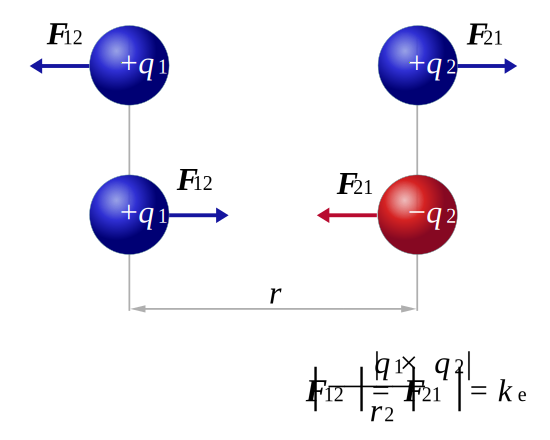
    </iframe>
  <figcaption><b>Fig.3</b> - Forces of charge</figcaption>
</figure>

#### Example 1

If a charge $q_1 = 5~\mu\mathrm{C}$ is located at $(1,2,3)~\mathrm{m}$ and charge $q_{2}=-8~\mu\mathrm{C}$ is located at $(4,7,8)~\mathrm{m}$, what is the force exerted by $q_1$ on $q_2$?

$$\begin{aligned} & \vec{F}_{1,2}=\frac{k q_1 q_2}{r^2 \hat{r}_{1,2}}=\frac{k q_1 q_2}{r_{1,2}} \vec{r}_{1,2} \\ 
& \vec{r}_{1,2}=\left(x_2-x_1\right) \hat{i}+\left(y_2-y_1\right) \hat{j}+\left(z_2-z_1\right) \hat{k} \\ 
& \vec{r}_{1,2}=(4-1) \hat{i}+(7-2) \hat{j}+(8-3) \hat{k} \\ 
& \vec{r}_{1,2}=3 \hat{i}+5 \hat{j}+5 \hat{k} \\ 
& \hat{r}_{1,2}=\frac{\vec{r}_{1,2}}{r_{1,2}}=\frac{3 \hat{i}+5 \hat{j}+5 \hat{k}}{\sqrt{3^2+5^2+5^2}}=\frac{3 \hat{i}+5 \hat{j}+5 \hat{k}}{59^{1 / 2}}\\
& \boxed{\vec{F}_{1,2}=k \frac{\left(5 \cdot 10^{-6} C\right)\left(-8 \cdot 10^{-6} C\right)}{59^{3 / 2}}(3 \hat{i}+5 \hat{j}+5 \hat{k})}\end{aligned}$$

#### Example 2

Three charges $(Q_1,Q_2,Q_3)$ are arranged as follows: The position of $Q_2$ is $d_2$ directly below $Q_1$. $Q_3$ is located $d_3$ directly to the right of $Q_2$. What is the force on $Q_2$.

$$\begin{align*}
\vec{F}_{1,2} & = \frac{kQ_{1}Q_{2}}{d_{2}^{3}} \cdot (-d_{2}\hat{j})\\
\vec{F}_{3,2} & = \frac{kQ_{3}Q_{2}}{d_{3}^{3}} \cdot (-d_{3}\hat{i})\\
\vec{F}_{1,2}+\vec{F}_{3,2} &= \boxed{-\frac{kQ_{3}Q_{2}}{d_{3}^{2}} \hat{\mathbf{i}}-\frac{kQ_{1}Q_{2}}{d_{2}^{2}} \hat{\mathbf{j}}}
\end{align*}$$

#### Topic IA Homework

##### Problem 1
Suppose we have a charge, $q_{1} = 5~\mu\mathrm{C}$. This charge makes an electric field some distance $r = 73~\mathrm{cm}$ away from it. Now suppose our measurement of $q_{1}$ is only accurate to within $0.2~\mu\mathrm{C}$, and our measurement of $r$ is only accurate to within $1.5~\mathrm{cm}$.

___

> **Tip:** Remember to convert units: $\mu\mathrm{C} = 10^{-6}~\mathrm{C}$ & $1~\mathrm{cm} = 0.01~\mathrm{m}$.

>**Online Calculator:** [Desmos Graph](https://www.desmos.com/calculator/zwffgu0id4)

If we were to calculate the electric field made by that charge at the indicated distance, what would be the uncertainty in our calculation due only to the uncertainty in the size of $q_{1}$?

$$\boxed{dE_{q1}=\frac{1}{2}\left(\frac{k\ \left(q_{1}+q_{error}\ \right)}{r^{2}}-\frac{k\ \left(q_{1}-q_{error}\ \right)}{r^{2}}\right)}$$

What is the uncertainty in our field calculation due only to the uncertainty in the charge separation $r$?

$$\boxed{dE_{r}=\left|\frac{kq_{1}}{\left(r+0.015\right)^{2}}-\frac{kq_{1}}{r^{2}}\right|}$$

What is the total uncertainty in our electric field calculation due to the uncertainty in the size of $q_1$ and the uncertainty in the charge separation $r$?

$$\boxed{dE_{tot}=\sqrt{d_{Eq1}^{2}+d_{Er}^{2}}}$$

##### Question 2
Two identical balls of $4.1~\mathrm{g}$ are suspended from threads of length $1.48~\mathrm{m}$ and carry equal charges as shown in the figure. Each ball is $1.5~\mathrm{cm}$ from the centerline.
___
<figure align="center">
  
  <figcaption><b>Fig.4</b> - Topic IA Homework: Problem 2</figcaption>
</figure>

>**Online Calculator:** [Desmos Graph](https://www.desmos.com/calculator/sscdj41hsw)

Assume that the angle $\theta$ is so small that its tangent can be replaced by its sine. This is called the small angle approximation and means that for small angles $\sin(\theta)=\tan(\theta)$. Find the magnitude of charge on one of the balls.

>**Tip:** $F_e=F_g\tan(\theta)$: [See here](https://www.sfu.ca/phys/100/lectures/HangingCharges/HangingCharges.html)

$$\boxed{q=2x\sqrt{\frac{mgd}{lk}}}$$

Now, assume the two balls are losing charge to the air very slowly. That means they'll be slowly approaching each other. If a ball is moving at an instantaneous speed of $4.4 \cdot 10^{-5}~\mathrm{m/s}$, at what rate is the ball losing charge? Start by writing the speed of the ball and the rate of change of the charge as symbolic derivatives, and then relate those derivatives. Give your answer in Coulombs per second $(\mathrm{C/s})$. Note that because the balls are losing charge so slowly, we can still use our results from the previous part, as the system is almost in equilibrium. Give your answer as a magnitude.

> **Tip:** Convert $x$ to $\mathrm{meters}$ and mass to $\mathrm{grams}$

$$\frac{dq}{dt} = \frac{dq}{dx} \cdot \frac{dx}{dt}$$
$$\frac{dq}{dx} =\frac{d}{dx}\left(2x^{3/2}\sqrt{\frac{mg}{lk}}\right)= 3x^{1/2}\sqrt{\frac{mg}{lk}}$$
$$\boxed{\frac{dq}{dt}=3x^{1/2}\sqrt{\frac{mg}{lk}} \cdot \frac{dx}{dt}}$$

##### Question 3
>**Online Calculator:** [Desmos Graph](https://www.desmos.com/calculator/ffig5atef3)

What is the magnitude of the electric field at a distance of $0.1~\mathrm{nm}$ from a thorium nucleus?

>**Tip:** Convert unites $1~\mathrm{nm} = 10^{-9}~\mathrm{m}$ & $q_{electron} = -1.602\cdot10^{-19}~\mathrm{C}$

$$\boxed{\vec{E} = \left|\frac{k\cdot\left(90\times q_{electron}\right)}{r^{2}}\right|}$$

What is the magnitude of the force on an electron at that distance?

$$\boxed{F=\left|\vec{E} \cdot q_{electron}\right|}$$

Treating the electron classically, that is, as a point object that can move around the nucleus at reasonably slow speeds, what is the frequency of the electron's motion? We're looking for the linear frequency here, not the angular frequency.

> **Tip:** $v=2\pi r f$; $m_{electron}=9.1093837\cdot10^{-31}~\mathrm{kg}$; and $F=\frac{mv^2}{r}$

$$\boxed{f=\sqrt{\frac{F}{m_{electron}\cdot r\cdot4\pi^{2}}}}$$

Again treating the electron classically, how fast it it moving?

$$\boxed{v=\sqrt{\frac{\left(F\cdot r\right)}{m_{electron}}}}$$

What would the magnitude of the force be if the distance of the electron from the nucleus were doubled?
$$\boxed{F_{\mathrm{new}} = \frac{F}{4}}$$

##### Problem 4

We have four charges, each of which has size given by some integer $A$, $B$, $C$, or $D$ times $q$, where $q = 1.00\cdot10^{-7}~\mathrm{C}$. The charges sit in a plane at the corners of a square whose sides have length $d = 80 ~\mathrm{cm}$ as shown in the diagram below. A charge, of size $E_q$, is placed at the origin at the center of the square.
___
<figure align="center">
  
  <figcaption><b>Fig.4</b> - Topic IA Homework: Problem 4</figcaption>
</figure>

>**Online Calculator:** [Desmos Graph](https://www.desmos.com/calculator/haj1lsqka6)

Let $A = 4$, $B = 4$, $C = 5$, $D = 6$, and $E = 2$. Consider the charge at the center of the square, $q_E$. What is the net $x$-component of the force on this charge?

1. $$\vec{E}_{q}=\frac{k\cdot q_E}{r^3} \cdot \left\langle \frac{d}{2},\frac{d}{2}\right\rangle $$

2. $$F = \underbrace{\mathbb{Z}}_{\mathbb{Z} \in[A,E]} \cdot \vec{E} = $$

3. $$r=\sqrt{\left(\frac{d}{2}\right)^2+\left(\frac{d}{2}\right)^2}=\sqrt{\frac{d^2}{2}}$$

4. $$\vec{E}_{q}= \left\langle\frac{k q_E \cdot d}{2\cdot\left(\frac{d^2}{2}\right)^{\frac{3}{2}}}, \frac{k q_E d}{2 \cdot\left(\frac{d^2}{2}\right)^{\frac{3}{2}}}\right\rangle = \left\langle \frac{\sqrt{2}kq_{E}}{d^2},\frac{\sqrt{2}kq_E}{d^2}\right\rangle$$

$$\boxed{F_{x}=\left|\left(B+C-A-D\right)\cdot\frac{\sqrt{2}kq_{E}^{2}E}{d^{2}}\right|}$$

$$\boxed{F_{y}=\left|(A+B-C-D)\cdot\frac{\sqrt{2}kq_{E}^{2}E}{d^{2}}\right|}$$

Consider the situation as described above with $A=B=C=D=1$ and $E=-1$.

1. If one were to triple the magnitude of the negative charge, the negative charge would be in equilibrium.

2. The equilibrium point at the center is a stable equilibrium for the negative charge for motion perpendicular to the plane of the square.

3. The sum of the forces on the center charge in the $x$-direction equals zero.

##### Problem 5
Electric forces between two charged objects tend to be much stronger in magnitude than the attractive gravitational force between them. Two particles of masses $7.06 ~\mathrm{kg}$ and $5.04 ~\mathrm{kg}$ and charges $7.81 ~\mu\mathrm{C}$ and $-3.64 ~\mu\mathrm{C}$ respectively are separated by a distance $25.6 ~\mathrm{cm}$. Find the magnitude of the ratio of the gravitational to electric forces between them.

> **Tip:** Consider the system as one dimensional

>**Online Calculator:** [Desmos Graph](https://www.desmos.com/calculator/ankdq69aa6)

$$F_{E}= \frac{kq_{1}q_{2}}{r^{2}}$$
$$F_{G}= \frac{Gm_{1}m_{2}}{r^{2}}$$

$$\mathrm{ratio} = \frac{F_{G}}{F_{E}} = \boxed{\left|\frac{Gm_{1}m_{2}}{kq_{1}q_{2}}\right|}$$

##### Problem 6
We have three charges, $Q_1, Q_2$, and $Q_3$, arranged in a straight line. $Q_2$ is $0.38 \mathrm{~m}$ to the right of $Q_1$. $Q_3$ is $0.12 \mathrm{~m}$ to the right of $Q_2$.

--- 
> **Online Calculator:** [Desmos Graph](https://www.desmos.com/calculator/ppvk7kkfha)

Assume that the charges are arranged as before, and that they have the following sizes: $Q_1=1.6~\mu \mathrm{C}, Q_2=-3~\mu \mathrm{C}, Q_3=2.8~\mu \mathrm{C}$. Calculate the total force on $Q_2$. If the net force is to the left, enter it as a negative number. Otherwise, enter it as a positive number. 

$$\sum F_{2} = F_{1,2}+F_{3,2} = \boxed{\frac{kQ_{1}Q_{2}}{d_{1}^{2}} -\frac{kQ_{3}Q_{2}}{d_{2}^{2}}}$$

Now we're going to change things a bit. The charges still have the same sizes and signs $\left(Q_1=1.6 ~\mu \mathrm{C}, Q_2=-3 ~\mu \mathrm{C}, Q_3=2.8 ~\mu \mathrm{C}\right)$. $Q_2$ is still $0.38 \mathrm{~m}$ to the right of $Q_1$. But now we're free to put $Q_3$ anywhere. Find the location at which $Q_3$ will feel zero net force. Write your answer as the distance $Q_3$ is from $Q_1$ with a negative sign if $Q_3$ is to the left of $Q_1$, and a plus sign otherwise.

> **Notes:** $Q_3$ has to be to the left of $Q_1$ since it will get repealed by $Q_1$ (left) and attracted to $Q_2$ (to the right). Since $Q_2$ is negative it cancels out the $(-)$ sign in front. Negative value of $|x|$ since it is to the left of the $Q_1$

$$ 0 = \frac{kQ_{1}Q_{2}}{x^{2}_{1,3}}+\frac{kQ_{2}Q_{3}}{(x+r_{1,2})^{2}}$$

$$x = \frac{d_{1}}{\sqrt{-\frac{Q_{2}}{Q_{1}}}-1}$$

### Topic IB: Coulomb's Law for Continuous Charge Distributions

#### Topic IB Studio

> **Online Calculator:** [Desmos Graph](https://www.desmos.com/calculator/lecu4avoqi)

##### Problem 3: Asymmetric Line Charge
A line of charge with a uniform charge density $\lambda=-14 ~\mathrm{nC/m}$ lies along the $y$-axis in the region $0\leq y\leq 4.9~\mathrm{m}$. Calculate the electric field of this line of charge at point $P$ on the $x$-axis a distance $0.6~\mathrm{m}$ from the origin. <u>Note</u>: The $r$-vector that you use in this problem should have a $y$-component that is a variable quantity, not the constant $h$.

<figure align="center">
  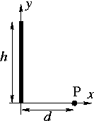
  <figcaption><b>Fig.5</b> - Asymmetric Line Charge.</figcaption>
</figure>

What is the $x$-component of the electric field at point $P$?

$$E_{x}=\int_{0}^{h}\frac{k\lambda d}{\left(d^{2}+y^{2}\right)^{\frac{3}{2}}}dy =\boxed{ \frac{k \lambda h}{d\left(h^2+d^2\right)^{\frac{1}{2}}}}$$

What is the $y$-component of the electric field at point $P$?

$$E_{y}=\int_{0}^{h}\frac{-k\lambda y}{\left(d^{2}+y^{2}\right)^{\frac{3}{2}}}dy=\boxed{-\frac{k\lambda((h^{2}+d^{2})^{\frac{1}{2}}-d)}{d(h^{2}+d^{2})^{\frac{1}{2}}}}$$

##### Problem 4: Ring of Charge
A uniform circular ring of charge $Q_{4}=8.26~\mu\mathrm{C}$ and radius $R=8.5~\mathrm{cm}$ is located in the $xy$-plane, centered on the origin as shown in the figure.

<figure align="center">
  
  <figcaption><b>Fig.6</b> - Ring of Charge.</figcaption>
</figure>

What is the magnitude of the electric field, $E$, at point $P$, located at $d_{z}=11~\mathrm{cm}$? 

$$E_{z}=\boxed{\frac{kQ_{4}d_{z}}{\left(d_{z}^{2}+R^{2}\right)^{\frac{3}{2}}}}$$

At what value of $z$ is the magnitude of the electric field, $E$, at maximum?

$$E\left(z\right)=\frac{kQ_{4}z}{\left(z^{2}+R^{2}\right)^{\frac{3}{2}}}$$

$$E'\left(z\right)=\frac{kQ_{4}}{\left(z^{2}+R^{2}\right)^{\frac{3}{2}}}-\frac{3\left(kQ_{4}z^{2}\right)}{\left(z^{2}+R^{2}\right)^{\frac{5}{2}}}$$

$$E'(z)=0 \Longrightarrow z_{\text{max}}=\boxed{\frac{R}{\sqrt{2}}}$$

What is the maximum value of the electric field $E_{\text{max}}$ at this location along the $z$-axis?

$$E_{\text{max}}=\underbrace{E\left(z_{\text{max}}\right)}_{f: \mathbb{R}\to\mathbb{R}}$$

Now take the limit of the original electric field expression for $z << R$. You should see that the electric field, $E$, is linearly proportional to $z$. If you place an electron along the $z$-axis very near the origin, the electron will experience a "restoring force" similar to that from a spring, i.e., $F_{z}=-kx$, where $\kappa$ is called the restoring constant. Find the value of $\kappa$ by grouping together all of the constants in the equation (basically everything but 
) and plugging values in. Note that the Coulomb constant $k$ and the spring constant $\kappa$ are not the same. <u>Note</u> also that we're looking for a positive number for that constant.

$$\kappa = \boxed{-\frac{kQ_{4}}{R^{3}}\cdot q_{\text{electron}}}$$

What is the frequency of small oscillations that an electron will undergo if it is released along the $z$-axis very near the origin?

$$f=\boxed{\frac{1}{2\pi}\sqrt{\frac{\kappa}{m_{\text{electron}}}}}$$

##### Problem 5: Non-Uniform Semicircular Charge
A semicircular ring as shown below has a linear charge density given by $\lambda = -B\cos(\theta)$, where $B$ is a positive constant and $\theta$ is the angle measured from the $x$-axis.

<figure align="center">
  
  <figcaption><b>Fig.7</b> - Non-Uniform Semicircular Charge.</figcaption>
</figure>

Determine a symbolic expression for the differential length occupied by this differential element of charge. 

$$\boxed{d\ell= R~\mathrm{d}\theta}$$

Using the differential length, determine the total charge on the semicircular ring in terms of $B$ and $R$. 

$$Q_{5}=\int_{-\frac{\pi}{2}}^{\frac{\pi}{2}}-B\cos\left(\theta\right)R\ \mathrm{d}\theta = \boxed{-2BR}$$

__Note:__ $E_{x}<0$ and $E_{y} =0$

For the $\mathrm{d}Q$ found above, write a symbolic expression for $\vec{r}$ assuming that point $P$ is located at the point $(a,0,0)$.

$$r_{x}=\boxed{a-R\cos\left(\theta\right)}$$

$$r_{y}=\boxed{-R\cdot \sin\left(\theta\right)}$$

Now it's time to put it all together. What is the final symbolic expression for the $x$-component of the electric field? Use "$k$" for the Coulomb constant. A couple things to look out for:

- Your integral for $E_{x}$ should involve $\mathrm{d}Q$ (written in terms of other variables), not the total $Q_{5}$ you calculated in an earlier part.

- The $r$ in the denominator of your integral should be the magnitude of the entire $r$-vector, not the magnitude of just a component of it.

$$E_{x} = \boxed{\int_{-\frac{\pi}{2}}^{\frac{\pi}{2}} \frac{-kB\cos \left(\theta \right)R\cdot \left(a-R\cos \left(\theta \right)\right)}{\left(\left(a-R\cos\left(\theta\right)\right)^2+\left(-R\cdot \sin\left(\theta\right)\right)^2\right)^{\frac{3}{2}}} \, \mathrm{d}\theta}$$

#### Topic IB Homework

##### Problem 1: Nonuniform Semicircle
A non-uniformly charged semicircle of radius $R=31.9~\mathrm{cm}$ lies in the $xy$-plane, centered at the origin, as shown. The charge density varies as the angle $\theta$ (in radians) according to $\lambda = 3.01\theta = \ell \theta$, where $\lambda$ has units of $\mu\mathrm{C}$ per meter.

<figure align="center">
  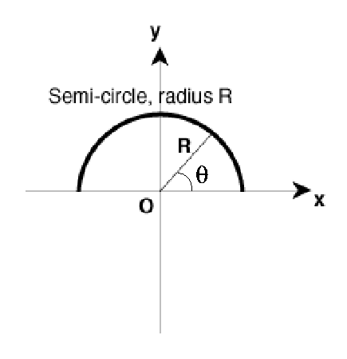
  <figcaption><b>Fig.8</b> - Nonuniform Semicircle.</figcaption>
</figure>

What is the total charge on the semicircle?

$$Q_{tot}=\boxed{\int_{0}^{\pi}\lambda R\ d\theta}$$

What is the $y$ component of the electric field at the origin?

$$\begin{align*}
E_{y}&=\int_{0}^{\pi}\frac{k\lambda R}{R^{3}}(-R)\sin\left(\theta\right)\ d\theta\\
&= -\int_{0}^{\pi}\frac{k\ell\theta}{R}\sin\left(\theta\right)\ d\theta\\
&= \boxed{-\frac{\pi k\ell}{R}}
\end{align*}$$

##### Problem 2: Field at End of Line of Charge

A charged rod of total length $7.2~\mathrm{m}$ lies centered on the $x$-axis as shown (the $L$ indicated in the picture is half of that number, meaning that $L = 3.6~\mathrm{m}$). The rod has a charge density which varies according to $\lambda = ax^2$ where $a = -24.9 ~\mu\mathrm{C}/\mathrm{m}^3$.

<figure align="center">
  
  <figcaption><b>Fig.9</b> - Field at End of Line of Charge.</figcaption>
</figure>

What is the total charge on the rod?

$$q=\int_{-L}^{L} \lambda\, \mathrm{d}\ell = \int_{-L}^{L}ax^{2}\, \mathrm{d}x = \boxed{\frac{2aL^{3}}{3}}$$

What is the $x$-component of the electric field at a point $P$ on the $x$-axis a distance of $D = 9.7~\mathrm{m}$ from the end of the rod? Use a negative sign for a field pointing in the $x$-direction.

$$\begin{align*}
E_{x}&=\int_{-L}^{L}\frac{ax^{2}k}{\left(D+L-x\right)^{2}}\, \mathrm{d}x\\
&= \boxed{-ak\left(-2D\ln\left(\frac{D}{2L+D}\right)-2L\ln\left(\frac{D}{2L+D}\right)-4L-\frac{2L^{3}}{D\left(D+2L\right)}\right)}
\end{align*}$$

##### Problem 4 Slowing E-Field

An electron with a speed of $v_i = 10 \times 10^{7}~\mathrm{m/s}$ enters an electric field of magnitude $\vec{E} = 5 \times 10^3~\mathrm{N/C}$, traveling along the field lines in the direction that slows its motion.

How long does it take the electron to stop?

$$a_{e} = \frac{F_e}{m_e}=\frac{q_e\cdot \vec{E}}{m_e}$$

$$t=\frac{v_f-v_i}{a_e} = \boxed{\frac{-v_{i}m_{e}}{q_{e}\cdot \vec{E}}}$$

How far will the electron travel in the field before stopping momentarily?

$$\begin{align*}
d & =v_{0}t+\frac{1}{2}at^{2}\\
&= \frac{-v_{0}^{2}m_{e}}{q_{e}E}+\frac{v_{0}^{2}m_{e}}{2q_{e}E}\\
&=\boxed{\frac{-v_{0}^{2}m_{e}}{2q_{e}E}}
\end{align*}$$

##### Problem 4: Uniformly Charged Rod
A charge $Q=8.65 \times 10^{-4}~\mathrm{C}$ is distributed uniformly along a rod of length $L=16.2~\mathrm{cm}$, extending from $y=-L / 2$ to $y=+L / 2$, as shown in the diagram below. A charge $q=1.2 \times 10^{-6}~\mathrm{C}$, and the same sign as $Q$, is placed at $(D,0)$, where $D=28~\mathrm{cm}$.

<figure align="center">
  
  <figcaption><b>Fig.10</b> -Uniformly Charged Rod.</figcaption>
</figure>

Consider the situation as described above and the following <b><u>true</u></b> statements.

- The $y$-components of the force on $q$ cancel.
- The charge on a segment of the rod of infinitesimal length $dy$ is given by $dQ=\frac{Q}{L} \, dy$.
- The total force on $q$ is generally in the $+x$-direction

Use integration to compute the total force on $q$ in the $x$-direction.

> **Note:** $\vec{r}=\langle D,y\rangle$

$$\begin{align*}F_{x}& =\int_{-\frac{L}{2}}^{\frac{L}{2}}\frac{kQqD}{L\left(y^{2}+D^{2}\right)^{\frac{3}{2}}}\,dy\\ &= \boxed{\frac{2kQq}{D(L^{2}+4D^{2})^{\frac{1}{2}}}} \end{align*}$$

##### Problem 5: Electric Field Line Concepts 

We have two equal and opposite point charges near each other (sometimes called an electric dipole). Consider the following **<u>true</u>** statements:

<figure align="center">
  
  <figcaption><b>Fig.10</b> - Electric Field Line Concepts.</figcaption>
</figure>

- A negative charge at point $D$ will accelerate towards the top of the page.
- A positive charge at point $C$ will accelerate towards the top of the page.

#### Key ideas from Topic IB 

1. Electric field produced by a continuous charge distribution is found by chopping into small chunks of charge $d Q$ and adding their contributions together by $\vec{E}=\int \frac{k d Q}{r^3} \vec{r}$

2. $\vec{r}$ points from each small chunk of charge to the location that you want to find the electric field.

3. $dQ$ (infinitesimal chunk of charge) can be expressed using charge densities and differential spatial elements (infinitesimal chunks of length)

>$\vec{r}$ points from <i>cause</i> to <i>effect</i>, or from
<i>source</i> to <i>observation point</i>. Sketch the system given, then mark out a $dq$, then draw an $\vec{r}$ for that $dq$ and observation point.

<figure align="center">
  <iframe src="Fig_11.svg" style="height: 400px; width:auto" sandbox>
    
    </iframe>
  <figcaption><b>Fig.11</b> - Charge of an object.</figcaption>
</figure>

<figure align="center">
  <iframe src="Fig_12.svg" style="height: 400px; width:auto" sandbox>
    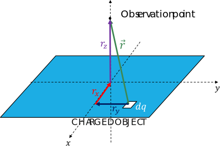
    </iframe>
  <figcaption><b>Fig.12</b> - Charge of an plane.</figcaption>
</figure>

$dq$ is located at some negative $x$ and $y$ location $\left(x=-x_0\right.$ and $y=-y_0)$ 
$$
\begin{aligned}
\vec{r}=y(-\hat{\jmath})+x(-\hat{\imath})+z_0(+\hat{k}) & =-y_0(-\hat{\jmath})+-x_0(-\hat{\imath})+z_0(+\hat{k}) \\
& =y_0(\hat{\jmath})+x_0(\hat{\imath})+z_0(+\hat{k})
\end{aligned}
$$

### Topic IC: Gauss's Law (1 of 2)

#### Key ideas from Topic IC

1. The electric flux through a <u>closed surface</u> is proportional to the amount of charge that is enclosed by the surface: $\Phi_E=\frac{q_{e n c l}}{\epsilon_0}$

2. Flux is a mathematical operation that allows us to count "how much" of something points through a surface. Electric flux through a closed surface is given by $\Phi_E=\oint \vec{E} \cdot d \vec{A}$.

3. Spherical, cylindrical, and planar symmetry allow us to solve for the electric field using Gauss's law: $\oint \vec{E} \cdot d \vec{A}=\underline{q_{\text {encl }}}$

__Electric Flux:__ Quantifies how much electric field points through a surface.

$$\Phi_{E}=\int\vec{E}\cdot \mathrm{d}\vec{A}$$ 

Electric flux through a closed surface is directly proportional to the amount of charge enclosed by that surface.

$$\Phi_{E}=\oint\vec{E}\cdot \mathrm{d}\vec{A} = \frac{q_{enc}}{\epsilon_{0}}$$

__Gaussian Surfaces:__ A Gaussian surface is a closed surface in three-dimensional space through which the flux of a vector field is calculated; usually the gravitational field, electric field, or magnetic field.

__Sign:__ The sign of flux through an open shape is ambiguous because there are two choices for $\hat{n}$. If the shape is closed, we can established a convention that 

##### Electric Flux Due to a Point Charge

A point charge $Q$ is a distance $d/2$ directly above the center of a square of
side $d$. What is the magnitude of the electric flux through the square?

<figure align="center">
  
  <figcaption><b>Fig.13</b> - Flux in a Sphere.</figcaption>
</figure>

What is the electric flux through the cube?

$$\boxed{\Phi_{E_{\mathrm{cube}}} = \frac{Q}{\epsilon_{0}}}$$

What is the electric flux through one face of the cube?

$$\boxed{\Phi_{E_{\mathrm{face}}} = \frac{Q}{6\epsilon_{0}}}$$

##### Flux through an Area III 
We’ve managed to set up an electric field that is modeled by $\vec{E} = Axy\hat{i} + Bx^{2}\hat{j}+Cy\hat{k}$ in the vicinity of the pictured cube that has side lengths $\ell$. What is the magnitude of the electric flux through the top surface of the cube?

1. What is the direction of $\mathrm{d}\vec{A}$ in terms of $x$, $y$ and $z$

$$\hat{k}$$

Perpendicular to the surface in the $z$-direction; Outward when there is a closed surface 

2. What is the magnitude of $\mathrm{d}\vec{A}$ in terms of $x$, $y$ and $z$

$$\left|\mathrm{d}\vec{A}\right| = \mathrm{d}x \,\mathrm{d}y$$

$$\begin{align*} \Phi_{E} &= \int \left(Axy\hat{i} + Bx^{2}\hat{j}+Cy\hat{k}\right)\cdot  \,\mathrm{d}x \,\mathrm{d}y\hat{k}\\ & = \int_{0}^{\ell}\int_{0}^{\ell} Cy \,\mathrm{d}x \,\mathrm{d}y\\ &= \boxed{\frac{1}{2}C\ell^3} \end{align*}$$

#### Topic IC Homework 

##### Problem 1: Flux Through an Area

We have an electric flux of magnitude $\Phi  = 152~\mathrm{Nm}^2\mathrm{/C}$ passing through a flat horizontal surface with an area of $A=0.62~\mathrm{m}^2$. The flux is due to a uniform electric field, which points $\theta_{1} = 13.7^{\circ}$  above the horizontal. Find the magnitude of the electric field.

> When the area is constant: $\Phi_{E} = E \cdot A\cos\left(\theta_{2}\right)$ where $\theta_{2}$ is the angle between the vector area and the electric field.

$$\vec{E}=\boxed{\frac{\phi_{1}}{A\cos\left(90^{\circ}-\theta_{1}\right)}}$$

##### Problem 2: Electric Flux Due to a Point Charge

We have point charge of size $Q=2.8~\mathrm{C}$ sitting a distance $\frac{d}{2}$ directly above the center of a square of side length $26~\mathrm{mm}$. What is the magnitude of the electric flux through the square? 

<figure align="center">
  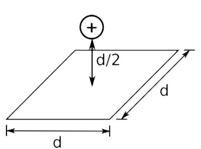
  <figcaption><b>Fig.14</b> - Electric Flux Due to a Point Charge.</figcaption>
</figure>

> **Note:** We can simply perform division by 6, as each side experiences an equal amount of electric field passing through it. Also the units are $\frac{\mathrm{N}\cdot \mathrm{m}^2}{\mathrm{C}}$.

$$\Phi_{E,\mathrm{face}} = \boxed{\frac{Q}{6\epsilon_{0}}}$$

##### Problem 3: Rectangular Box Flux Problem
Suppose we've managed to set up an electric field that can be described by the function $\vec{E}=w_1 y^2 \hat{\imath}+w_2 z^2 \hat{\jmath}+w_3 x^2 \hat{k}$ where $w_1=11 \mathrm{~N} /\left(\mathrm{C} \cdot \mathrm{m}^2\right), w_2=11 \mathrm{~N} /\left(\mathrm{C} \cdot \mathrm{m}^2\right)$, and $w_3=10 \mathrm{~N} /\left(\mathrm{C} \cdot \mathrm{m}^2\right)$. Let's look at a rectangular box in the Cartesian coordinate axes, shown below, with dimensions $a=1 \mathrm{~m}$ along the $x$-axis, $b=6.5 \mathrm{~m}$ along the $y$-axis, $c=3 \mathrm{~m}$ along the $z$-axis.

<figure align="center">
  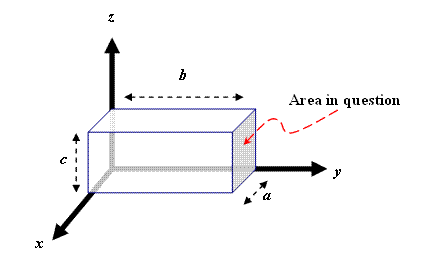
  <figcaption><b>Fig.15</b> - Rectangular Box Flux.</figcaption>
</figure>

What is the magnitude of the electric flux passing through the shaded area?

$$E\cdot dA = E_{y}\, dA$$
$$\begin{align*}\Phi &= \int_{0}^{a}\int_{0}^{c}w_{2}z^{2}\, dz\, dy\\
&=\boxed{\frac{c^{3}aw_{2}}{3} }\end{align*}$$

##### Problem 5: Qualitative Solid Spherical
We have a solid metal sphere with total charge $Q$ and radius $R$ centered on the origin. Note that $>>$ and $<<$ mean "much larger than" and "much smaller than", respectively. <b><u>True</u></b> statements are listed below.

1. The charge on the conducting sphere must all be on the outer surface of the sphere.

2. The electric field for $r>R$ is the same as the field that would be made by a point charge with size $Q$ at the origin.

3. The electric field for $r>>R$ is the same as the field that would be made by a point charge with size $Q$ at the origin.

#### Topic IC Studio

##### Problem 2: On-Axis Electric Field of a Disk

You have now seen examples during lecture on how to calculate the electric field for a line of charge and a ring of charge - both uniformly distributed. This activity will ask you to solve for the electric field, on-axis, of a uniformly-charged disk sitting in the $xy$-plane. Below is a picture of the situation of interest.Note: Treat it as a totally flat disk and ignore its thickness in the $x$-direction. Also, let $x$ be the distance between the center of the disc and point $P$.

<figure align="center">
  
  <figcaption><b>Fig.17</b> - On-Axis Electric Field of a Disk.</figcaption>
</figure>

Identify the length and width of $dQ$ in terms of the variables in the figure above.

**Length** = $2\pi a$; **Width** = $da$ 

Using the charge density, determine $dQ$ in terms of the appropriate variables.

$$\boxed{dQ = \frac {Q}{\pi R^2} (2 \pi a\,\mathrm{d}a)}$$

Since our $dQ$ is a thin ring of charge, we cannot easily write out an expression for $\vec{r}$ – there isn't one single vector that points to every part of the ring at once. However, this problem has pretty good symmetry. Only one component of the E-field will survive, so we only have to write the component of $\vec{r}$ that gives us that part of the field. What is that component?

$$\boxed{\vec r = x \hat \imath}$$

Identify the full distance $r$ from $dQ$ to the point of interest in terms of the variables in the figure above. Keep in mind that due to symmetry, every point along the ring that makes up $dQ$ is at the same distance from the observation point. Also, even though some components of $\vec{r}$ were not used in the previous question the denominator of Coulomb's law still uses the total magnitude of $r$.

$$\boxed{r = \sqrt {a^2 + x^2}}$$

Substitute everything into Coulomb's Law, perform the integration, and get the electric field, $\vec{E}$ , made by the disc at point $P$.

$$\begin{align*} \vec{E} &=\int_{0}^{R}\frac{kQ\left(2\pi a\right)x}{\pi R^{2}\left(a^{2}+x^{2}\right)^{\frac{3}{2}}}\, \mathrm{d}a\\ &= \frac{kQx}{R^{2}}\int_{0}^{R}\frac{\left(2a\right)}{\left(a^{2}+x^{2}\right)^{\frac{3}{2}}}\, \mathrm{d}a\\ &=\frac{kQx}{R^{2}}\left[\frac{-1}{\sqrt{x^2+a^2}}\right]_{0}^{R}\\ &= \boxed{\frac {2 k Q}{R^2} \left [1 - \frac{x}{\sqrt{x^2 + R^2}} \right ] \mathbf{\hat \imath}}\end{align*}$$

#### Problem 4: Flux Through Surfaces
An imaginary surface made of three flat pieces is shown. The entire surface is placed in a uniform electric field $\vec{E}$ pointing toward the top of the page, as shown in the side view.

<figure align="center">
  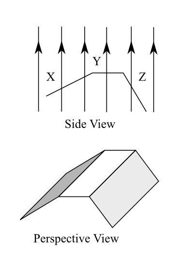
  <figcaption><b>Fig.18</b> - Flux Through Surfaces.</figcaption>
</figure>

Rank the magnitude of the electric flux through sides, from *least* to *greatest*.

$$\boxed{Z,Y,X}$$

What is the sign of the electric flux through the entire surface $XYZ$?

- The sign cannot be determined without more information since this is an open surface. 

### Topic 1D: Gauss's Law (2 of 2)

#### Key ideas from Topic ID

1. Spherical, cylindrical, and planar symmetry allow us to solve for the electric
field at a location using Gauss’s law: $\oint \vec{E} \cdot d\vec{A} = \frac{q_{encl}}{\epsilon_{0}}$

We draw the Gaussian surface to include the location we want to know the
electric field and check whether the surface has appropriate symmetry:
- $\vec{E} \mathbin{\|} d\vec{A}$ or $\vec{E}\bot d\vec{A}$ everywhere on the surface
- $E$ is constant (magnitude) everywhere on the surface
3. Be careful when finding the charge enclosed. Draw out charge distributions.

__Gauss's Law:__

$$\boxed{\Phi = \oint \vec{E} \cdot d\vec{A} = \frac{q_{encl}}{\epsilon_{0}}}$$

<i><b>Always true:</b></i> You can always find the flux if you know the charge enclosed by the surface.

<b><i>Sometimes:</i></b> Solve for $E$. Requires situations with spherical,
cylindrical, or planar symmetry.

##### Typical Conventions for Notation

Convention: We often use lower-case $r$ to indicate where we’re looking
at the field, and upper-case $R$ to indicate the radius of the object. Put another way, $r$ is a coordinate, and $R$ is a constant. This is not guaranteed, but it’s common.

<figure align="center">
  <iframe src="Fig_18.svg" style="height: 200px; width:auto" sandbox>
    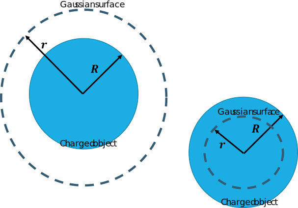
    </iframe>
  <figcaption><b>Fig.18</b> - Types of radius.</figcaption>
</figure>

##### Necessary Symmetries

If our system has good symmetry, we can simplify $\oint \vec{E}\cdot d\vec{A}$ down to $EA$ in two steps.

- <b><i>Spherical symmetry:</i></b> We can rotate an object about any axis without changing it.

- <b><i>Cylindrical symmetry:</i></b> We can rotate an object about the long axis, or translate it along the same axis, without changing it.

- <b><i>Planar symmetry:</i></b> We can translate an object along either of two axes without changing it.

<figure align="center">
  <iframe src="Fig_17.svg" style="height: 200px; width:auto" sandbox>
    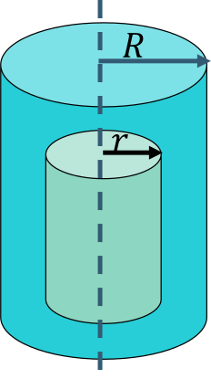
    </iframe>
  <figcaption><b>Fig.17</b> - Charge distribution, and a Gaussian
surface for a Cylinder.</figcaption>
</figure>

We start with $\oint \vec{E}\cdot d\vec{A}$ a charge distribution, and a Gaussian
surface.

1. E-field always points exactly parallel or perpendicular to every part of the Gaussian surface

$$\oint \vec{E}\cdot d\vec{A} = \int E \, dA$$

2. E-field doesn’t change on the Gaussian surface

$$\oint \vec{E}\cdot d\vec{A} = \int E \, dA = E\int \, dA = EA$$

##### Starting Points

$Q_{encl} = \int \rho, dV$ or $Q_{encl} = \int \sigma, dA$ are safe, general starting
points.
If the charge densities are constant (uniform charge), these
reduce to $Q=\rho V$ or $Q=\sigma A$.

#### Topic ID Homework

##### Problem 1: Non-conducting Sphere

We have a nonconducting solid sphere of radius $R_1=0.25~\mathrm{cm}$ carrying a uniformly distributed positive charge of $Q=6.9 ~\mathrm{nC}$.

What is the magnitude of the electric field at a point $r=1.7 ~\mathrm{cm}$ from the center of the sphere?

> Surface Area of Sphere: $A=4\pi R^2$; Volume of a sphere: 

$V=\frac{4}{3}\pi r^3$
$$\begin{align*}
\vec{E}\cdot A &= \underbrace{\frac{(4/3)\pi r^3}{(4/3)\pi R_{1}^3}}_{\text{Ratio of Volume}} \cdot \frac{Q}{\epsilon_0}\\
&= \frac{rQ}{R_{1}\epsilon_0}\\
\vec{E} &= \frac{rQ}{AR_{1}\epsilon_0} = \boxed{\frac{rQ}{4\pi R_{1}^3 \epsilon_0}}
\end{align*}$$

What is the magnitude of the electric field at a point $R_{2} = 4.5~\mathrm{cm}$ from the center of the sphere?

$$\vec{E}=\boxed{\frac{Q}{4\pi R_{2}^{2}\epsilon_{0}}}$$

Now consider a conducting sphere with the same radius and total charge. What is the magnitude of the electric field at a point $r=1.7 ~\mathrm{cm}$ from the center of the sphere?

<i>In conducting materials all the charge is pushed to the outside so there is no charge enclosed inside the sphere. </i>

What is the magnitude of the electric field at a point $R_{2} = 4.5~\mathrm{cm}$ from the center of the conducting sphere?

$$\vec{E}=\boxed{\frac{Q}{4\pi R_{2}^{2}\epsilon_{0}}}$$

##### Problem 2: Insulating Cylindrical Shell

A long insulating cylindrical shell has an inner radius of $a = 1.3 ~\mathrm{m}$ and an outer radius of $b = 1.64 ~\mathrm{m}$. The shell has a constant charge density of $\sigma =1.6 \times 10^{-9} ~\mathrm{C}/~\mathrm{m}^3$. The picture shows an end-on cross-section of the cylindrical shell.

<figure align="center">
  
  <figcaption><b>Fig.19</b> - Insulating Cylindrical Shell.</figcaption>
</figure>

What is the magnitude of the electric field at a distance of $r = 1.77 ~\mathrm{m}$ from the axis?

> Surface area of cylinder: $A=2\pi r \ell$

$$Q= \int_{a}^{b}\sigma \left(2\pi r \ell\right) \, dr=\sigma \pi\left(b^2-a^2\right) \cdot \ell$$

$$\vec{E}=\boxed{\frac{\sigma\left(b^2-a^2\right)}{2 \cdot r \cdot\epsilon_0}}$$

What is the magnitude of the electric field at a distance of $r = 1.51 ~\mathrm{m}$ from the axis?

$$\vec{E}= \boxed{\frac{\sigma\left(r^{2}-a^{2}\right)}{2\cdot r\cdot e_{0}}}$$

What is the magnitude of the electric field at a distance of $r = 0.97 ~\mathrm{m}$ from the axis?

<i>The gauss’s sphere is enclosing no charge so the $E$ field is $0$. </i>

##### Problem 3: Nonuniformly Charged Cylinder 2

An infinitely long solid cylinder of radius $R=10 ~\mathrm{cm}$ has a non-uniform volume charge density given by $\rho=4r^3$ where $\rho$ is in $~\mathrm{C/m}^3$ when $r$ is in meters.

$$d\vec{E} = \frac{dQ_{encl}}{A\epsilon_0}$$

$$dQ_{encl} = 2\pi rh \left(4r^3\right) \, dr$$

This is the gauss’s cylinder split into shells radially with some arbitrary height $h$. This is how we are splitting it since the charge density changes based on radius so each shell this way has the same charge.

Calculate the magnitude of the electric field $r_{1} = 5 ~\mathrm{cm}$ from the axis of the cylinder.

$$\vec{E} = \int^{r_1}_{0} \frac{2\pi r_{1}h \left(4r^3\right)}{2\pi h r_1 \epsilon_0}\, dr = \int_{0}^{r_1} \frac{4r^3}{r_{1}\epsilon_0} \, dr = \boxed{\frac{4r_{1}^4}{5\epsilon_0}}$$

Calculate the magnitude of the electric field at a distance of $r_{2} = 21 ~\mathrm{cm}$ from the axis of the cylinder.

$$\vec{E} = \int^{r_2}_{0} \frac{2\pi r_{2}h \left(4r^3\right)}{2\pi h r_2 \epsilon_0}\, dr = \int_{0}^{r_2} \frac{4r^3}{a\epsilon_0} \, dr = \boxed{\frac{4r_{2}^5}{5\epsilon_0}}$$

##### Problem 4: Two Charged Plates
We have two uniformly charged parallel plates, as shown. Their widths are much larger than the separation between the plates. The magnitudes of the charges on each are equal. $a$, $b$, and $c$ indicate the regions just above, in between, and just below the plates, respectively.

<figure align="center">
  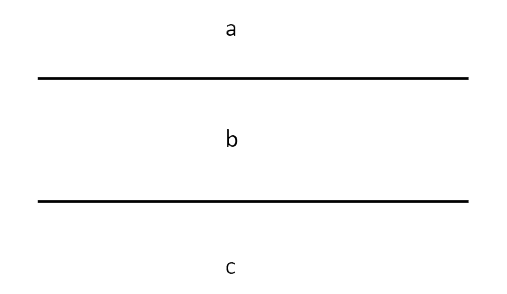
  <figcaption><b>Fig.16</b> - Two Charged Plates.</figcaption>
</figure>

For the above situation the following are true:

1. If both plates are positively charged, there is no electric field in region $b$.

2. If the plates are oppositely charged, there is no electric field in region $c$ & $a$

Now let's suppose that the plates are squares with side length $\ell = 1.2~\mathrm{cm}$, and that they have equal and opposite charges of magnitude $Q = 2.3~\mu\mathrm{C}$. What is the magnitude of the electric field in region $b$?

$$E_{\mathrm{sheet}} = \boxed{\frac{Q}{\ell^2 \epsilon_{0}}}$$

#### Topic ID Studio

##### Problem 2: Uniformly Charged Sphere
Now that we've got some of the basics down, we're going to use Gauss's Law to solve for the exact electric field present in a specific situation. A nonconducting solid sphere of radius $R=2.3 ~\mathrm{cm}$ carries a uniformly distributed positive charge of $Q=7.4 ~\mathrm{nC}$.

Consider a point inside the sphere. What is the direction of the electric field at this point?

- Radially outward

Suppose the point inside the sphere is located at $r = 1.9 ~\mathrm{cm}$. If we draw a Gaussian sphere with that radius (and concentric with the charged sphere), how much charge will that Gaussian sphere enclose?

$$\rho_{1}=\frac{Q}{V_{\mathrm{tot}}} = \frac{\rho}{\left(\frac{4}{3}\right)\pi R^{3}}$$

$$Q_{\text{encl}} = \int_{0}^{r} \rho \, \mathrm{d}V = \int_{0}^{r} \rho \left(\frac{4}{3}\right)\pi R^{3}\, \mathrm{d}r = \boxed{\rho_{1}\cdot\left(\frac{4}{3}\right)\pi r^{3}}$$

With that in mind, calculate the magnitude of the electric field at that radius.

$$\vec{E}_{\text{encl}}=\boxed{\frac{Q_{\text{encl}}}{4\pi r^{2}\epsilon_{0}}}$$

Next, calculate the magnitude of the electric field at a point $3.9 ~\mathrm{cm}$ away from the center of the sphere. Note that this point is outside the sphere, and thus your Gaussian surface should end up enclosing all of the available charge.

$$Q_{\text{out}}=\rho_{1}\cdot\left(\frac{4}{3}\right)\pi R^{3}$$

$$\vec{E}_{\text{out}}=\boxed{\frac{Q_{\text{out}}}{4\pi R_{2}^{2}\epsilon_{0}}}$$

Now assume that the sphere is conducting. Calculate the magnitude of the electric field $r= 1.9 ~\mathrm{cm}$ from the center of the sphere. Recall that charge will push itself to the outside edge of a conducting object.

- There will be no charge since $r<R$

Again assume that we have a conducting sphere. Calculate the magnitude of the electric field $r= 3.9 ~\mathrm{cm}$ from the center of the sphere.

$$\vec{E}_{\text{out}}=\boxed{\frac{Q_{\text{out}}}{4\pi R_{2}^{2}\epsilon_{0}}}$$

##### Problem 3: Nonuniformly Charged Cylinder
An infinitely long solid cylindrical insulator of radius $R=18 \mathrm{~cm}$ has a nonuniform volume charge density of $\rho\left(r\right)=C r^2$ with $r$ being the distance from the axis of the cylinder (in meters) and $C$ being $4 \mu \mathrm{C} / \mathrm{m}^5$. Calculate the magnitude of the electric field at a distance of $r=7 \mathrm{~cm}$ from the axis of the cylinder. For the most part, this problem will go the same way as a problem involving uniform charge, except for the calculation of $Q_{\text{enc}}$. Since the charge density is non-uniform, we need to use an integral for that instead of just multiplying $\rho$ times $V$.

$$Q_{\text{enc}}=2\pi\int_{0}^{r_{1}}\rho\left(r\right)\cdot r\,\mathrm{d}r = \frac{\pi r_{1}^{4}C}{2}$$

$$\vec{E}=\boxed{\frac{Q_{\text{enc}}}{2\pi r_{1}\epsilon_{0}}}$$

##### Problem 4: Uniformly Charged Cylinder

A very long, solid cylinder with radius $R$ has a positive charge uniformly distributed throughout it, with charge per unit volume of $\rho_{0}$.

What is the direction of the electric field from this cylinder?
- Radially outward

Derive an expression for the magnitude of the electric field inside the cylinder at a distance $r_{G}$ from the axis of the cylinder in terms of $\rho_{0}$.

$$\begin{align*}
\vec{E}_{\text{in}}&=\frac{\pi\rho_{0}\cdot r_{G}^{2} \cdot \ell}{2\pi\cdot r_{G} \cdot \ell\cdot \epsilon_{0}}\\&=\boxed{\frac{\rho_{0}\cdot r_{G}}{2\cdot \epsilon_{0}}}\end{align*}$$

Now let's do this problem from a different point of view. Instead of thinking about the charge per volume, let's suppose someone gives us the charge per unit length $\lambda$. Find the electric field outside the cylinder in terms of that lambda and other variables.

$$\begin{align*}\vec{E}_{\text{out}}&= \frac{\frac{\lambda}{\pi R^{2}} \cdot R^{2}\cdot \ell}{2\pi \cdot r_{G}\cdot \ell \cdot \epsilon_{0}}\\&=\boxed{\frac{\lambda}{2\pi \cdot \epsilon_{0} \cdot r_{G}}}\end{align*}$$

##### Problem 5: Nonuniformly Charged Sphere
The charge density of a sphere of radius $R_{s}$ can be written as $\rho=Br^{n}$, with $B$ a constant and $r$ the distance from the center of the sphere. __Note:__ Here we are dealing exclusively within the region inside of the actual sphere!

Determine the value of $n$ that will make the electric field within the sphere a constant. For that, I suggest just solving for the electric field with $n$ left as a variable. Then look at your E-field expression and see what value of $n$ will get rid of the dependence.

$$q=\int Br^{n} \cdot 4\pi r^{2} \, \mathrm{d}r = 4\pi B\left[\frac{r^{n+3}}{n+3}\right]$$

$$\vec{E} = \frac{4\pi B \cdot r^{n+3}}{4\pi R^2 \epsilon_{0}\left(n+3\right)} $$

$$\boxed{n=-1}$$

Assuming that the sphere has the density function you determined for the first part (including the specific value of $n$ and a total charge of $q$) , solve symbolically for $B$ in terms of $q$ and $R_{s}$.

$$Q= 4\pi B \int_{0}^{R_s} r \, \mathrm{d}r = 2\pi B R_{s}^{2}$$

$$\boxed{B=\frac{q}{2\pi \cdot R_{s}^{2}}}$$

### Topic IE: Electric Potential (1 of 2)

#### Topic IE Homework

##### Problem 1: Asymmetric Line Charge Voltage
A line of charge with a non-uniform charge density $\lambda = ay$, where $a = -34 ~\mathrm{nC/m}^2$ lies along the $y$-axis with one end at the origin and the other at $y=h$, where $h = 1.7 ~\mathrm{m}$.

<figure align="center">
  
  <figcaption><b>Fig.17</b> - Asymmetric Line Charge Voltage.</figcaption>
</figure>

What is the total charge?

$$Q=\int_{0}^{h}ay\, \mathrm{d}y=\boxed{\frac{ah^2}{2}}$$

Calculate the electric potential of this line of charge at point $P$ on the $X$-axis a distance $d=1.2~\mathrm{m}$ from the origin. Assume the potential equals zero at infinity.
$$V=\int_{0}^{h}\frac{kay}{\left(d^{2}+y^{2}\right)^{\frac{1}{2}}}\, \mathrm{d}y=\boxed{ka((h^{2}+d^{2})^{\frac{1}{2}}-d)}$$

##### Problem 2 Equipotential Lines

The lines in the figure below show the equipotential contours in the plane of three point charges, $Q_1$, $Q_2$, and $Q_3$. Note that these are point charges (one is not bigger in size than the others; they're points). That means that the potential goes to infinity as you approach them. We stop showing countours past plus and minus $7~\mathrm{kV}$. The white space is where the potential is greater or less than that. The values of the equipotential lines are in $\mathrm{kV}$, and we labeled the $+1$, $0$, and $-1~\mathrm{kV}$ contours. The positions of the charges are also labeled.

<figure align="center">
  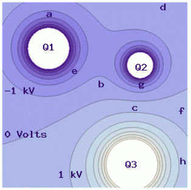
  <figcaption><b>Fig.18</b> - Equipotential Lines.</figcaption>
</figure>

The following are __true__ statements: 

- Charge $Q_2$ is the smallest negative charge.
- The electric field at point $e$ is stronger than the field at point $c$.

##### Problem 3: Parallel Plate II
The potential difference between two parallel plates is $\Delta V = 385 ~\mathrm{V}$. An alpha particle with mass $m= 6.64 \times 10^{-27} ~\mathrm{kg}$ and charge of $q=3.20 \times 10^{-19} ~\mathrm{C}$
 is released from rest near the positive plate. What is the speed of the alpha particle when it reaches the other plate? The distance between the plates is $d=26.2 ~\mathrm{cm}$.

> For this problem recall conservation of energy.

$$\Delta U = q_{\mathrm{partical}}\cdot \Delta V = \frac{1}{2} mv^2$$

$$v = \boxed{\sqrt{\frac{2q_{\mathrm{partical}}\cdot \Delta V}{m}}}$$

##### Problem 4 Rain Drop
A spherical rain drop carries a charge of $q=3.800 \times 10^{-8} ~\mathrm{C}$ and has an electric potential of $\Delta V = 7.727\times 10^{4} ~\mathrm{V}$ at the surface. Find the surface area of the drop assuming that the potential equals zero at infinity.

$$\Delta V =\frac{kq}{r} \leadsto r = \frac{kq}{\Delta V} $$

$$\text{Surface Area} = \boxed{\frac{4\pi k^2q^2}{\Delta V}}$$

##### Problem 5: Two Charge Potential
Consider the figure shown below. $Q_1 = 1.3 \times 10^{-9} ~\mathrm{C}$ and $Q_2 = -5.35 \times 10^{-9} ~\mathrm{C}$. Calculate the electric potential at the location marked `3`. Charges $Q_1$, $Q_2$, and point `3` are all located at integer coordinates that you can read off of the graph. Assume the electric potential at infinity is zero.

<figure align="center">
  
  <figcaption><b>Fig.18</b> - Two Charge Potential.</figcaption>
</figure>

> **Tip:** Note that the units on the graph are in $\mathrm{cm}$, note the conversion to $\mathrm{m}$ in the calculations for the radii below.

$$r_{1,3} = \sqrt{\left(0.03\right)^{2}+\left(0.04\right)^{2}}=5\cdot 10^{-2}\quad \text{and}\quad r_{2,3} = \sqrt{\left(0.02\right)^{2}+\left(0.04\right)^{2}} = 2\sqrt{5}\cdot 10^{-2}$$

$$\sum V = \boxed{\underbrace{\frac{kQ_1}{r_{1,2}}}_{V_1}+\underbrace{\frac{kQ_2}{r_{2,3}}}_{V_2}}$$